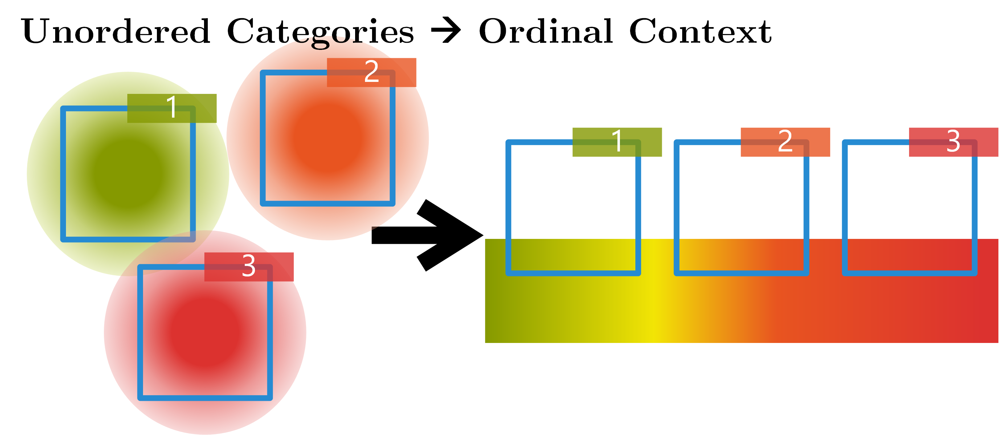
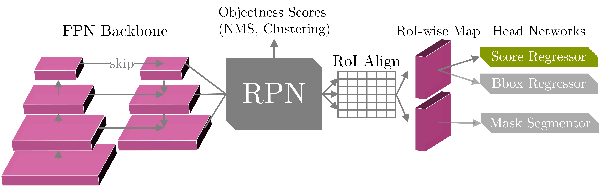
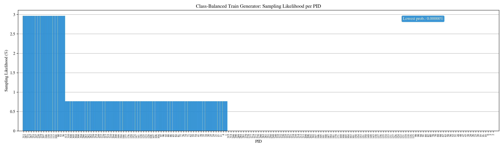

Copyright © German Cancer Research Center (DKFZ), <a href="https://www.dkfz.de/en/mic/index.php">Division of Medical Image Computing (MIC)</a>. 
Please make sure that your usage of this code is in compliance with the code <a href="LICENSE">license</a>.

## Release Notes
0.0.2 - Now with updated torch (>=1.3) and torchvision (>=0.4) dependencies and on python-3.7.5 basis.

## Introduction
This repository holds the code framework used in the paper Reg R-CNN: Lesion Detection and Grading under Noisy Labels [1].
The framework is a fork of MIC's [medicaldetectiontoolkit](https://github.com/MIC-DKFZ/medicaldetectiontoolkit) with added regression
capabilities.

As below figure shows, the regression capability allows for the preservation of ordinal relations in the training signal as opposed to a standard categorical classification loss like the cross entropy loss (see publication for details).
<p align="center"></p><br>
Network Reg R-CNN is a version of Mask R-CNN [2] but with a regressor in place of the object-class head (see figure below). In this scenario, the first stage makes foreground (fg) vs background (bg) detections, then the regression head determines the class on an ordinal scale. Consequently, prediction confidence scores are taken from the first stage as opposed to the head in the original Mask R-CNN.
<p align="center"></p><br>

In the configs file of a data set in the framework, you may set attribute self.prediction_tasks = ["task"] to a value "task" from ["class", "regression_bin", "regression"]. "class" produces the same behavior as the original framework, i.e., standard object-detection behavior. "regression" on the other hand, swaps the class head of network Mask R-CNN [2] for a regression head. Consequently, objects are identified as fg/bg and then the class is decided by the regressor. For the sake of comparability, "regression_bin" produces a similar behavior but with a classification head. Both methods should be evaluated with the (implemented) Average Viewpoint Precision instead of only Average Precision.

Below you will found a description of the general framework operations and handling. Basic framework functionality and description are for the most part identical to the original [medicaldetectiontoolkit](https://github.com/MIC-DKFZ/medicaldetectiontoolkit).

<br/>
[1] Ramien, Gregor et al., <a href="https://arxiv.org/abs/1907.12915">"Reg R-CNN: Lesion Detection and Grading under Noisy Labels"</a>. In: UNSURE Workshop at MICCAI, 2019.<br>
[2] He, Kaiming, et al.  <a href="https://arxiv.org/abs/1703.06870">"Mask R-CNN"</a> ICCV, 2017<br>
<br>

## Overview
This is a comprehensive framework for object detection featuring:
- 2D + 3D implementations of common object detectors: e.g., Mask R-CNN [2], Retina Net [3], Retina U-Net [4]. 
- Modular and light-weight structure ensuring sharing of all processing steps (incl. backbone architecture) for comparability of models.
- training with bounding box and/or pixel-wise annotations.
- dynamic patching and tiling of 2D + 3D images (for training and inference).
- weighted consolidation of box predictions across patch-overlaps, ensembles, and dimensions [4] or standard non-maximum suppression.
- monitoring + evaluation simultaneously on object and patient level. 
- 2D + 3D output visualizations.
- integration of COCO mean average precision metric [5]. 
- integration of MIC-DKFZ batch generators for extensive data augmentation [6].
- possible evaluation of instance segmentation and/or semantic segmentation by dice scores.
<br/>

[3] Lin, Tsung-Yi, et al.  <a href="https://arxiv.org/abs/1708.02002">"Focal Loss for Dense Object Detection"</a> TPAMI, 2018.<br>
[4] Jaeger, Paul et al. <a href="http://arxiv.org/abs/1811.08661"> "Retina U-Net: Embarrassingly Simple Exploitation
of Segmentation Supervision for Medical Object Detection" </a>, 2018

[5] https://github.com/cocodataset/cocoapi/blob/master/PythonAPI/pycocotools/cocoeval.py<br/>
[6] https://github.com/MIC-DKFZ/batchgenerators<br/><br>

## How to cite this code
Please cite the Reg R-CNN publication [1] or the original publication [4] depending on what features you use.

## Installation
Setup package in virtual environment
```
git clone https://github.com/MIC-DKFZ/RegRCNN.git.
cd RegRCNN
virtualenv -p python3.7 regrcnn_env
source regrcnn_env/bin/activate
python setup.py install
```
##### Custom Extensions
This framework uses two custom mixed C++/CUDA extensions: Non-maximum suppression (NMS) and RoIAlign. Both are adapted from the original pytorch extensions (under torchvision.ops.boxes and ops.roialign).
The extensions are automatically compiled from the provided source files under RegRCNN/custom_extensions with above setup.py. 
However, the extensions need to be compiled specifically for certain GPU architectures. Hence, please ensure that the architectures you need are included in your shell's
environment variable ```TORCH_CUDA_ARCH_LIST``` before compilation. 

Example: You want to use the modules with the new TITAN RTX GPU, which has 
Compute Capability 7.5 (Turing Architecture), but sometimes you also want to use it with a TITAN Xp (6.1, Pascal). Before installation you need to
```export TORCH_CUDA_ARCH_LIST="6.1;7.5"```. A link list of GPU model names to Compute Capability can be found here: https://developer.nvidia.com/cuda-gpus. 
Note: If you'd like to import the raw extensions (not the wrapper modules), be sure to import torch first.

## Prepare the Data
This framework is meant for you to be able to train models on your own data sets.

In order to include a data set in the framework, create a new folder in RegRCNN/datasets, for instance "example_data". Your data set needs to have a config file in the style of the provided example data sets "lidc" and "toy". It also needs a data loader meeting the same requirements as the provided examples. Likely, you will also need a preprocessing script that transforms your data (once per data set creation, i.e., not a repetitive operation) into a suitable and easily processable format.
Important requirements: 
- The framework expects numpy arrays as data and segmentation ground truth input.
- Segmentations need to be suited for object detection, i.e., Regions of Interest (RoIs) need to be marked by integers (RoI-ID) in the segmentation volume (0 is background). Corresponding properties of a RoI, e.g., the "class_targets" need to be provided in a separate array or list with (RoI-ID - 1) corresponding to the index of the property in the list (-1 due to zero-indexing). Example: A data volume contains two RoIs. The second RoI is marked in the segmentation by number 2. The "class_targets" info associated with the data volume holds the list [2, 3]. Hence, RoI-ID 2 is assigned class 3.
- This framework uses a modified version of MIC's batchgenerators' segmentation-to-bounding-box conversion tool. In this version, "class_targets", i.e., object classes start at 1, 0 is reserved for background. Thus, if you use "ConvertSegToBoundingBoxCoordinates" classes in your preprocessed data need to start at 1, not 0. 


Two example data loaders are provided in RegRCNN/datasets. The way I load data is to have a preprocessing script, which after preprocessing saves the data of whatever data type into numpy arrays (this is just run once). During training / testing, the data loader then loads these numpy arrays dynamically. Please note the data input side is meant to be customized by you according to your own needs and the provided data loaders are merely examples: LIDC has a powerful data loader that handles 2D/3D inputs and is optimized for patch-based training and inference. Due to the large data volumes of LIDC, this loader is slow. The provided toy data set, however, is light weight and a good starting point to get familiar with the framework. It is fully creatable from scratch within a few minutes with RegRCNN/datasets/toy/generate_toys.py.

## Execute
1. Set I/O paths, model and training specifics in the configs file: RegRCNN/datasets/_your_dataset_/configs.py
2. i) Train the model: 

    ```
    python exec.py --mode train --dataset_name your_dataset --exp_dir path/to/experiment/directory       
    ``` 
    This copies snapshots of configs and model to the specified exp_dir, where all outputs will be saved. By default, the data is split into 60% training and 20% validation and 20% testing data to perform a 5-fold cross validation (can be changed to hold-out test set in configs) and all folds will be trained iteratively. In order to train a single fold, specify it using the folds arg: 
    ```
    python exec.py --folds 0 1 2 .... # specify any combination of folds [0-configs.n_cv_splits]
    ```
    ii) Alternatively, train and test consecutively:
    ```
    python exec.py --mode train_test --dataset_name your_dataset --exp_dir path/to/experiment/directory       
    ``` 
3. Run inference:
    ```
    python exec.py --mode test --exp_dir path/to/experiment/directory 
    ```
    This runs the prediction pipeline and saves all results to exp_dir.
4. Additional settings:
    - Check the args parser in exec.py to see which arguments and modes are available.
    - E.g., you may pass ```-d``` or ```--dev``` to enable a short development run of the whole train_test procedure (small batch size, only one epoch, two folds, one test patient, etc.).     


## Models

This framework features models explored in [4] (implemented in 2D + 3D): The proposed Retina U-Net, a simple but effective Architecture fusing state-of-the-art semantic segmentation with object detection,<br><br>
<p align="center"></p><br>
also implementations of prevalent object detectors, such as Mask R-CNN, Faster R-CNN+ (Faster R-CNN w\ RoIAlign), Retina Net, Detection U-Net (a U-Net like segmentation architecture with heuristics for object detection.)<br><br><br>
<p align="center"></p><br>

## Training annotations
This framework features training with pixelwise and/or bounding box annotations. To overcome the issue of box coordinates in 
data augmentation, we feed the annotation masks through data augmentation (create a pseudo mask, if only bounding box annotations provided) and draw the boxes afterwards.<br><br>
<p align="center"></p><br>


The framework further handles two types of pixel-wise annotations: 

1. A label map with individual ROIs identified by increasing label values, accompanied by a vector containing in each position the class target for the lesion with the corresponding label (for this mode set get_rois_from_seg_flag = False when calling ConvertSegToBoundingBoxCoordinates in your Data Loader). This is usual use case as explained in section "Prepare the data".
2. A binary label map. There is only one foreground class and single lesions are not identified. All lesions have the same class target (foreground). In this case the data loader runs a Connected Component Labelling algorithm to create processable lesion - class target pairs on the fly (for this mode set get_rois_from_seg_flag = True when calling ConvertSegToBoundingBoxCoordinates in your data loader). 

## Prediction pipeline
This framework provides an inference module, which automatically handles patching of inputs, and tiling, ensembling, and weighted consolidation of output predictions:<br><br><br>
<br><br>


## Consolidation of predictions 
### Weighted Box Clustering
Multiple predictions of the same image (from  test time augmentations, tested epochs and overlapping patches), result in a high amount of boxes (or cubes), which need to be consolidated. In semantic segmentation, the final output would typically be obtained by averaging every pixel over all predictions. As described in [4], **weighted box clustering** (WBC) does this for box predictions:<br>
<p align="center"><br><br></p>
<p align="center"><br><br></p>

To enable WBC, set self.clustering = "wbc" in your configs file.

### Non-Maximum Suppression
Test-time predictions can alternatively be aggregated with standard non-maximum suppression. In your configs file, simply set self.clustering = "nms" instead of "wbc". 

As a further alternative you may also choose no test-time aggregation by setting self.clustering = None.

## Visualization / Monitoring
In opposition to the original framework, this fork uses tensorboard for monitoring training and validation progress. Since, for now, the framework cannot easily be updated to pytorch >= 1.x, we need third-party package [tensorboardX](https://github.com/lanpa/tensorboardX) to use tensorboard with pytorch.

You can set an applicable choice of implemented metrics like "ap" for Average Precision or "auc" for patient-level ROC-AUC in the configs under self.metrics = [...]. Metrics are then evaluated by evaluator.py and recorded in monitor_metrics. logger.metrics2tboard sends monitor_metrics to your tensorboard logfiles at the end of each epoch.
You need to separately start a virtual tensorboard server, pass it your experiment directory (or directories, but it crashes if its more than ~5 experiments) and navigate to the server address. (You can also read up on tensoardboard usage in the original documentation). 

### Example: 
1. Activate your virtualenv where tensorboard is installed.
2. Start tensorboard server. For instance, your experiment directory is
    _yourexpdir_: <br> 
    ```tensorboard --port 6007 --logdir yourexpdir```
3. Navigate to ```localhost:6007``` in your browser.

### Output monitoring
For qualitative monitoring, example plots are saved to _yourexpdir_/plots for training and validation and _yourexpdir_/test/example_plots for testing. Note, that test-time example plots may contain unconsolidated predictions over test-time augmentations, thereby possibly showing many overlapping and/or noisy predictions. You may adapt/use separate file RegRCNN/inference_analysis.py to create clean and nice plots of (consolidated) test-time predictions.

## Balancing Mechanism of Example Data Loader
The data loaders of the provided example data sets employ a custom mechanism with the goal of assembling target-balanced batches or training sequences. I.e., the amount of examples shown per target class should be near balance. 

The mechanism creates a sampling-likelihood distribution, as shown below, over all available patients (PIDs). At batch generation, some patients are drawn according to this distribution, others are drawn completely randomly (according to a uniform distribution across all patients). The ratio of uniformly and target-dependently drawn patients is set in your configs file by configs.batch_random_ratio. configs.balance_target determines which targets are considered for the balancing distribution.

The balancing distribution assigns probabilities s.t. expected occurrences of fg and bg RoIs among all classes are as similar as possible.
The balance is naturally limited by multiple RoIs occurring in the same patient (e.g, if each patient has 4 RoIs of class 1 and 1 RoI of class 2 the best balancing ratio achievable is still 4:1).
See utils/dataloader_utils.BatchGenerator.balance_target_distribution.

Experience has shown, that showing at least one foreground example in each batch is most critical, other properties have less impact.

<p align="center"><br><br></p>

## Unittests
unittests.py contains some verification and testing procedures, which, however, need you to adjust paths in the TestCase classes before execution. Tests can be used, for instance, to verify if your cross-validation folds have been created correctly, or if separate experiments have the same fold splits.


# License
This framework is published under the [APACHE 2.0 License](https://github.com/MIC-DKFZ/RegRCNN/blob/master/LICENSE)